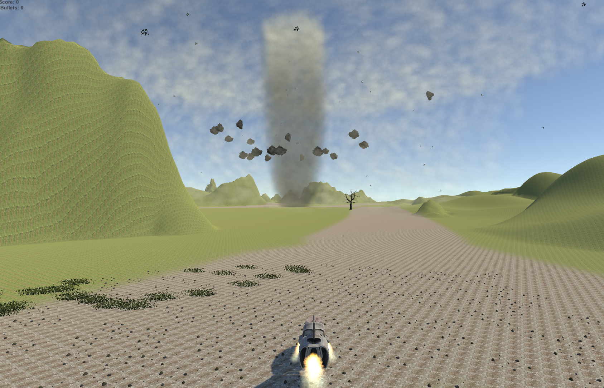
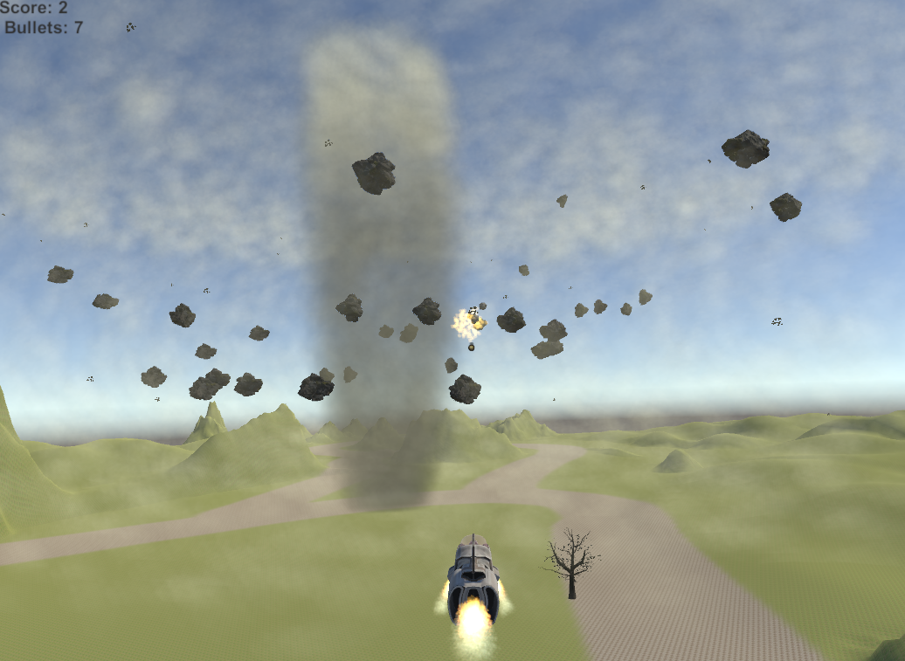
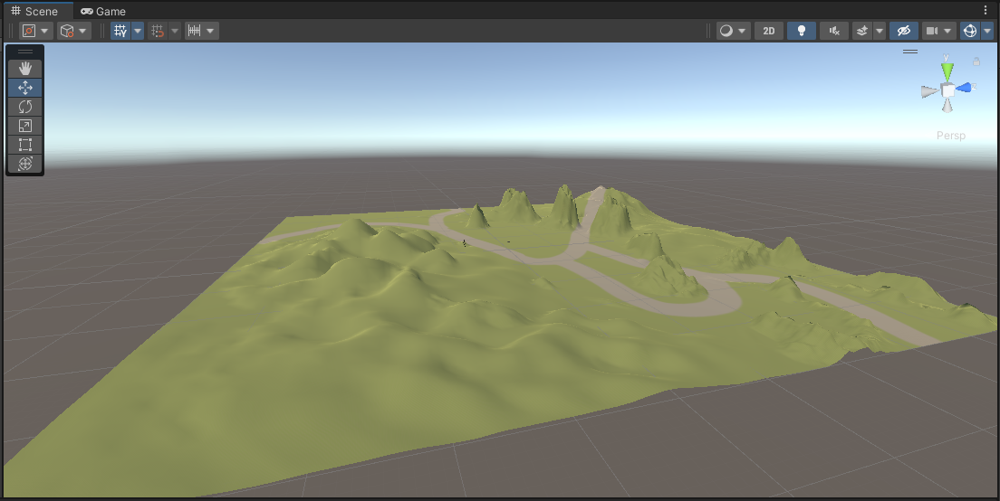
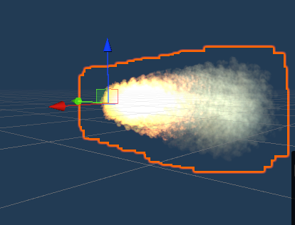
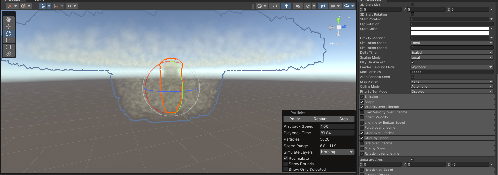
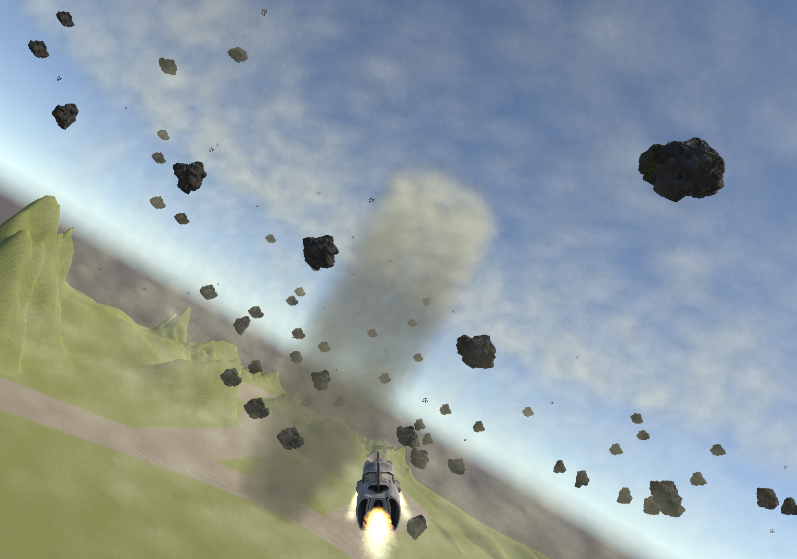

# DH2323-Project Planet Protector

### Authors  
Sam Maltin & Harald Shiva Olin

## Overview 
Our main goal with this game was to combine flying, shooting rocks and simulating a hurricane. In the game, you find yourself in an
environment where there is a hurricane with rocks spiraling around it. Your job is to
break up these rocks before they crash into your home planet.

## Background and Description 
we have always been inspired by the classic games we grew up with, like Asteroids.
Building on these inspirations, we wanted to create a game that emulates the same
engagement and excitement but with our twist. Our project, Planet Protector,”is
a testament to this idea. We have blended elements of navigation, precision, and
shooting. The game situates the player in a spacecraft in the midst of a rock-filled tornado. The rock spirals
dangerously around the tornado, posing a threat to the player’s home planet. The
player’s task is to navigate through this environment and destroy the rocks before
they collide with the home planet. 

## Development Process and Reflections
The development process was initiated with a brainstorming session for game ideas.
Once the concept of Planet Protector was decided upon, we embarked on creating
the environment, game mechanics, and interactivity. Development was carried out
using Unity, with scripting in C# to control game mechanics and interaction.
We faced several challenges, including getting the spacecraft controls to feel intui-
tive and implementing a particle system that convincingly simulates a tornado. Each
problem was approached systematically, using a combination of troubleshooting and
trial-and-error, providing valuable lessons in persistence, problem-solving, and the
importance of testing. For a better overview of how our day to day work looked like,
please check our blog: https://dh2323projectaircraft.wordpress.com/

### Design
The design involves planing the game’s environment, the hurricane, the spacecraft,
and the rocks. The hurricane and the rock were added to make a realistic touch to
the game.

### Coding
We used Unity game engine, making use of its in-built physics for collision detec-
tion and movement.We used C# for scripting the game logic, wich involve capturing
user inputs, controlling the spacecraft, shooting mechanism, movement of the spi-
raling rocks, and managing the hurricane. The script also handles the creation and
management of the particle system that visually represented the spacecraft engine
flames.

### Particle system
Particle systems in Unity were used to simulate the hurricane, leaves, and spacecraft
engine flames. The hurricane’s particle system doesn’t interact with the game objects
but adds to the immersive environment.

## Future improvements
### A easy one
Further implementations of the project could be many. One of the closest ones that
we thought of implementing was the possibility of the floating rocks to be able to
hurt the player/aircraft. In the current version of the game if the aircraft gets hit by
a rock the aircraft spins around and becomes hard to control for a moment. Instead
of this we could implement a health system for the aircraft that triggers when a rock
collides with the aircraft. We could further include this in the UI by showing a health
bar, when the health reaches zero the game would be over and the player would have
the option to start a new one.

### A slightly harder one
This implementation is fairly easy to implement but a harder one we were thinking of
implementing was the use of an actual tornado system. This would make the project
much more complex but would be a fun addition to the game. For this, we would need
to find a sufficient mathematical model for the Tornado. Another possibility
was to add collision to the particle system that we used for the tornado and let the
rocks collide with the system and add a script for how the rocks should react while
colliding.
If we wanted to simulate a real tornado it could be possible that the entire game
component would become superfluous since it probably would be enough for a project
in and of itself. There are alot of studies about the mathematical models of tornados
out there so for future work that is definitly something we could consider.

## Work Process
On this project we decided to do everything together and to use pair programming.
Both party members took turn switching the roles of navigator and pilot. We used
Vscode to be able to code on the same file at the same time. Even though we could
have made things more efficiently by working in parallell we decided that it would be
better for us to do everything in the project together so we both could learn from it.
We could also benefit from githubs branching system if we worked in parallell but since we decided to work together we didn’t use that
feature.

